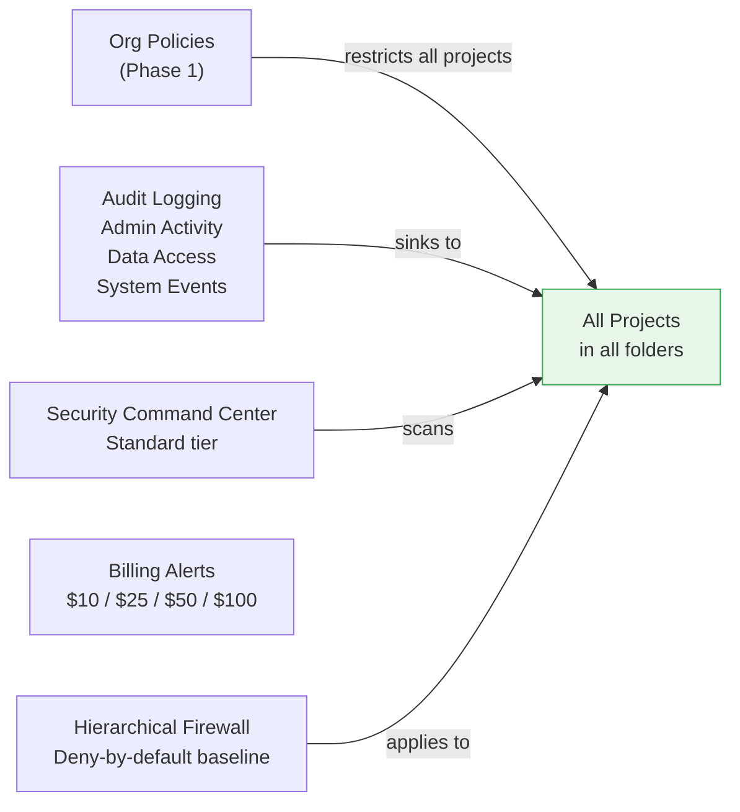

# Diagram: GCP Organization Hierarchy

> Renders in GitHub, GitLab, and VS Code with the Mermaid extension.

## Resource Hierarchy

```mermaid
graph TD
    ORG["🏢 GCP Organization\n(org_domain)"]

    ORG --> INFRA["📁 infrastructure/"]
    ORG --> SEC["📁 security/"]
    ORG --> SS["📁 shared-services/"]
    ORG --> PROD["📁 prod/"]
    ORG --> NONPROD["📁 nonprod/"]
    ORG --> SANDBOX["📁 sandbox/"]

    INFRA --> NET_PROD["📦 networking-host-prod\nShared VPC host\nCloud NAT · Cloud DNS"]
    INFRA --> NET_NONPROD["📦 networking-host-nonprod\nShared VPC host\nCloud NAT · Cloud DNS"]

    SEC --> LOG["📦 logging-central\nLog sinks (all projects)\nBigQuery · GCS archive"]
    SEC --> SECPROJ["📦 security-project\nKMS · Secret Manager\nSCC · Binary Auth policy"]

    SS --> CICD["📦 cicd-platform\nArtifact Registry\nGitHub WIF provider"]
    SS --> SHARED["📦 shared-services\nCloud DNS (private)\nShared internal APIs"]

    PROD --> GKE_PROD["📦 gke-prod\nPrivate GKE cluster\nWorkload Identity\nBinary Auth ON"]
    PROD --> APP_PROD["📦 app-{name}-prod\n(per application)\nAttached to prod VPC"]

    NONPROD --> GKE_NONPROD["📦 gke-nonprod\nPrivate GKE cluster\nWorkload Identity"]
    NONPROD --> APP_NONPROD["📦 app-{name}-nonprod\n(per application)\nAttached to nonprod VPC"]

    SANDBOX --> SBX["📦 sandbox\nFree-form experiments\nAuto-cleanup policy"]

    style ORG fill:#4285F4,color:#fff,stroke:#2956a3
    style INFRA fill:#EA4335,color:#fff,stroke:#b31412
    style SEC fill:#EA4335,color:#fff,stroke:#b31412
    style SS fill:#FBBC04,color:#000,stroke:#c69500
    style PROD fill:#34A853,color:#fff,stroke:#1e7e34
    style NONPROD fill:#34A853,color:#fff,stroke:#1e7e34
    style SANDBOX fill:#9AA0A6,color:#fff,stroke:#6b7075
```

## Folder Purpose Summary

| Folder | Trust Level | Network | Contains |
|---|---|---|---|
| `infrastructure/` | High | Hub VPCs | Shared VPC host projects only |
| `security/` | High | Attached to prod VPC | Logging, KMS, SCC, Secret Manager |
| `shared-services/` | Medium-High | Attached to nonprod VPC | CI/CD, Artifact Registry, DNS |
| `prod/` | High | Attached to prod VPC | All production workloads |
| `nonprod/` | Medium | Attached to nonprod VPC | Dev, staging workloads |
| `sandbox/` | Low | Standalone (no Shared VPC) | Unrestricted experiments |

## Org-Level Controls (apply to all folders)

