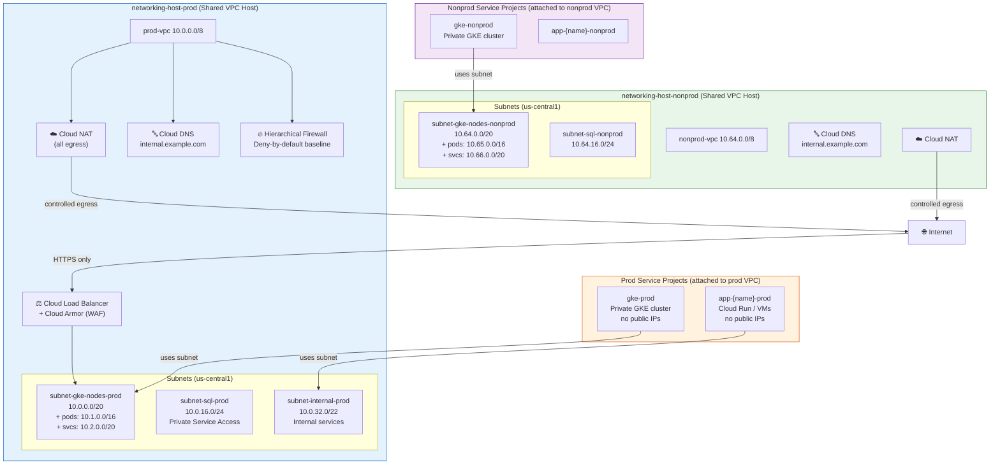
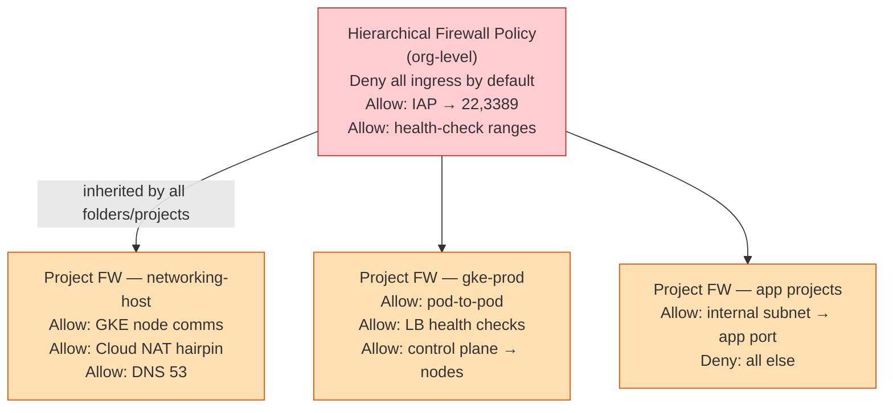
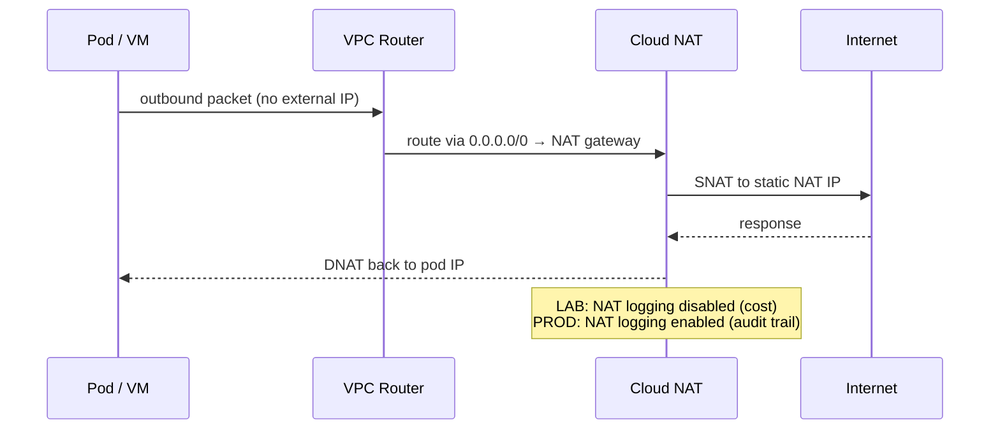

# Diagram: Network Topology

## Hub-and-Spoke Overview

## Subnet Registry

| Subnet | CIDR | Environment | Purpose | Secondary Ranges | PGA |
|---|---|---|---|---|---|
| `subnet-gke-nodes-prod` | `10.0.0.0/20` | prod | GKE nodes | pods `10.1.0.0/16`, svcs `10.2.0.0/20` | ✅ |
| `subnet-sql-prod` | `10.0.16.0/24` | prod | Cloud SQL PSA | — | ✅ |
| `subnet-internal-prod` | `10.0.32.0/22` | prod | Internal services | — | ✅ |
| `subnet-gke-nodes-nonprod` | `10.64.0.0/20` | nonprod | GKE nodes | pods `10.65.0.0/16`, svcs `10.66.0.0/20` | ✅ |
| `subnet-sql-nonprod` | `10.64.16.0/24` | nonprod | Cloud SQL PSA | — | ✅ |

PGA = Private Google Access (all APIs reachable without public IP)

## Firewall Rule Hierarchy

## Egress Path

