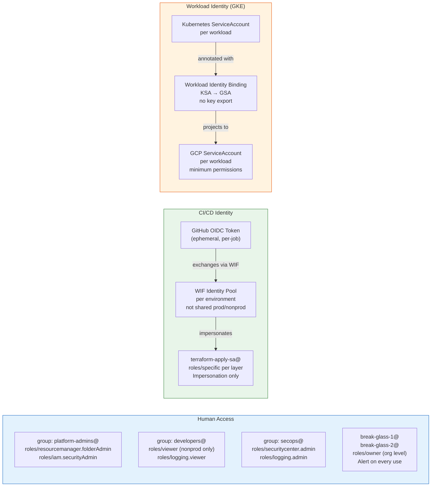
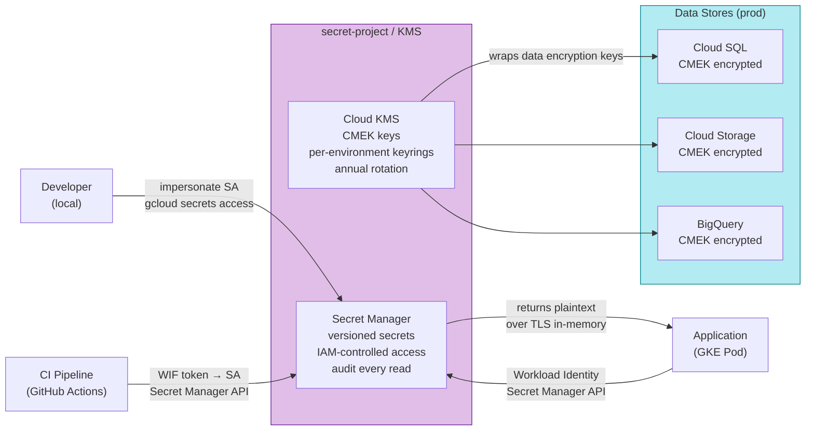

# Diagram: Security Architecture

## Defense-in-Depth Layers

```mermaid
graph TD
    subgraph LAYER0["Layer 0 — Perimeter"]
        CA["Cloud Armor<br/>WAF · DDoS protection<br/>IP allowlist/denylist"]
        VPC_SC["VPC Service Controls<br/>API-level perimeter<br/>(prod only, Phase 4)"]
    end

    subgraph LAYER1["Layer 1 — Identity & Access"]
        WIF["Workload Identity Federation<br/>Zero static credentials<br/>CI/CD + app workloads"]
        IAM["IAM — Least Privilege<br/>No primitive roles<br/>Group-based bindings only"]
        BG["Break-Glass Accounts<br/>2 accounts, separate MFA<br/>Alert on any use"]
        OSLOGIN["OS Login<br/>Enforced via org policy<br/>No SSH keys on VMs"]
    end

    subgraph LAYER2["Layer 2 — Network"]
        PRIV["Private-by-Default<br/>No public IPs on workloads<br/>Cloud NAT for egress"]
        HFW["Hierarchical Firewall<br/>Deny-by-default baseline"]
        PSA["Private Service Access<br/>Cloud SQL, Memorystore<br/>never exposed to internet"]
    end

    subgraph LAYER3["Layer 3 — Compute"]
        SHIELDED["Shielded VMs<br/>Secure Boot · vTPM<br/>Integrity Monitoring"]
        BINAUTH["Binary Authorization<br/>All container images attested<br/>No unverified images in prod"]
        PSP["Pod Security Standards<br/>restricted profile<br/>No privileged containers"]
    end

    subgraph LAYER4["Layer 4 — Data"]
        CMEK["CMEK<br/>Customer-managed keys<br/>All data stores in prod"]
        KMS["Cloud KMS<br/>Keys in dedicated project<br/>Separated from data"]
        SM["Secret Manager<br/>All secrets centralised<br/>Version + audit every access"]
    end

    subgraph LAYER5["Layer 5 — Detection & Response"]
        SCC["Security Command Center<br/>Misconfig detection<br/>Threat detection"]
        AUDIT["Cloud Audit Logs<br/>Admin Activity<br/>Data Access<br/>System Events"]
        LOGMET["Log-Based Metrics<br/>Failed auth alerts<br/>Privilege escalation<br/>Config changes"]
    end

    LAYER0 --> LAYER1
    LAYER1 --> LAYER2
    LAYER2 --> LAYER3
    LAYER3 --> LAYER4
    LAYER4 --> LAYER5

    style LAYER0 fill:#FFCDD2,stroke:#C62828
    style LAYER1 fill:#FFE0B2,stroke:#E65100
    style LAYER2 fill:#FFF9C4,stroke:#F9A825
    style LAYER3 fill:#DCEDC8,stroke:#558B2F
    style LAYER4 fill:#B2EBF2,stroke:#00838F
    style LAYER5 fill:#E1BEE7,stroke:#6A1B9A
```

## IAM Model

## Secret & Key Management Flow

## Threat Model Summary

| Threat | Likelihood | Impact | Control |
|---|---|---|---|
| Stolen CI credentials | Medium | Critical | WIF eliminates static credentials |
| Rogue insider | Low | Critical | Org policies + IAM least-privilege + audit logs |
| Supply chain (container image) | Medium | High | Binary Authorization + Artifact Registry only |
| Data exfiltration via API | Medium | High | VPC Service Controls (prod perimeter) |
| Misconfigured public resource | High | High | Org policy: deny public access (GCS, SQL) |
| Log tampering | Low | High | Logs routed to immutable sinks immediately |
| KMS key compromise | Very Low | Critical | Keys in isolated project, HSM-backed, rotation |
| Privilege escalation via SA | Low | High | No key exports, impersonation requires IAM binding |
| DDoS / web attack | Medium | Medium | Cloud Armor in front of all external LBs |
