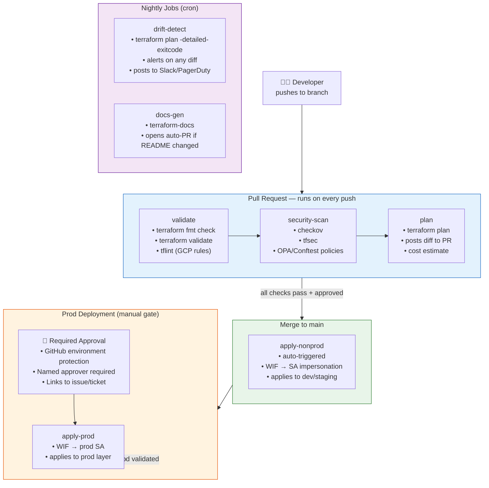
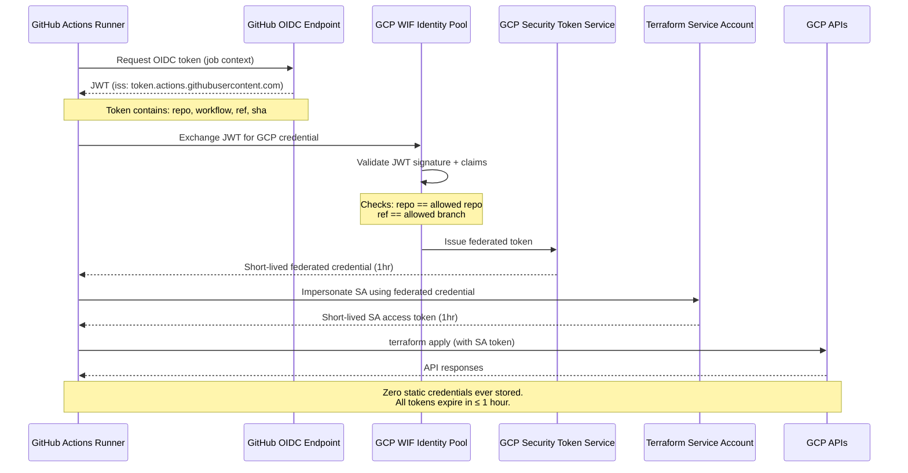
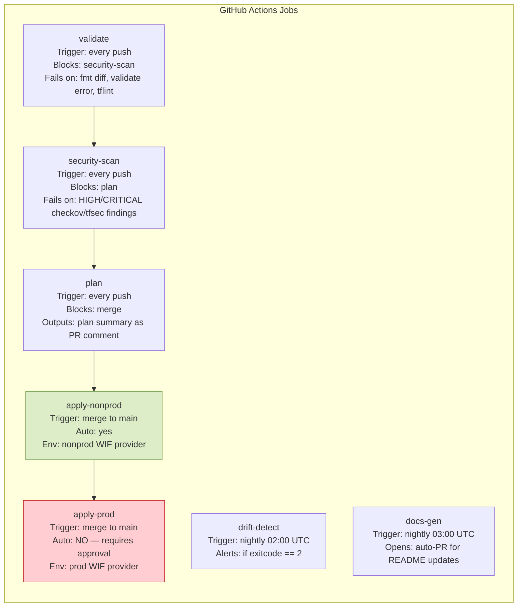

# Diagram: CI/CD Pipeline

## End-to-End Flow

## Workload Identity Federation — Credential Flow

## Job Definitions

## Environment Separation

| Environment | WIF Pool | Terraform SA | Apply Trigger | Approval Required |
|---|---|---|---|---|
| nonprod | `wif-pool-nonprod` | `terraform-apply-nonprod@...` | Auto on merge to `main` | No |
| prod | `wif-pool-prod` | `terraform-apply-prod@...` | Manual gate | Yes — named approver |

**Why separate WIF pools per environment:**
A compromised nonprod pipeline cannot forge a prod credential even if it knows the prod SA email.
The WIF pool validates which repo + branch the token was issued for — a nonprod pool will never
issue credentials bound to the prod SA. See ADR-001 for related state isolation rationale.
