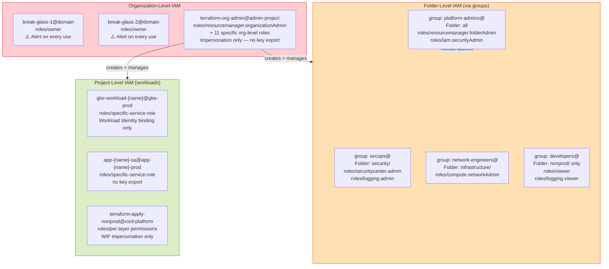
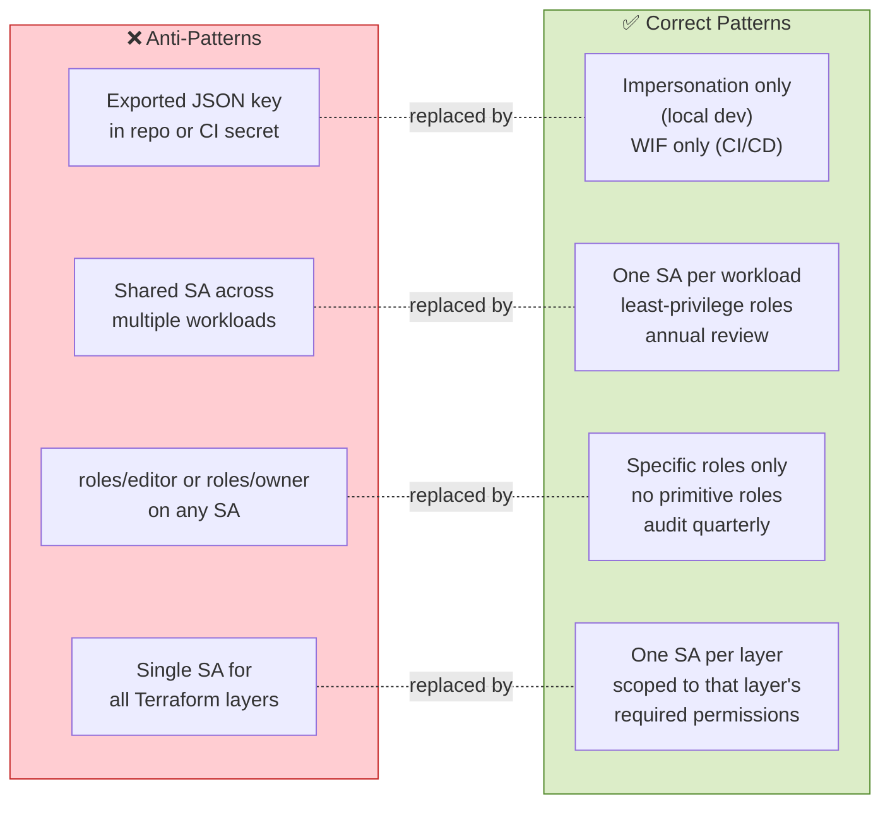
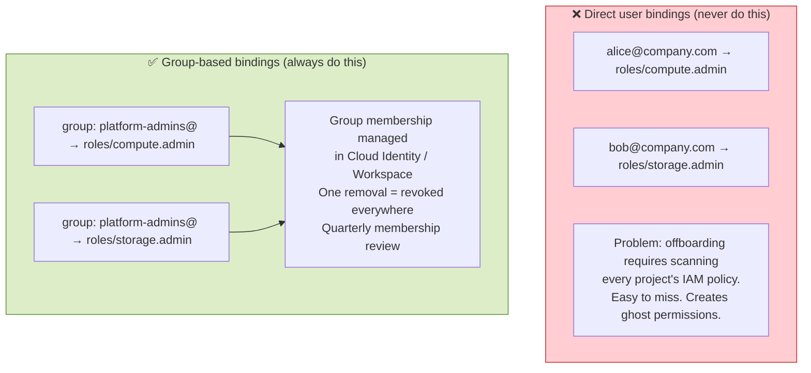
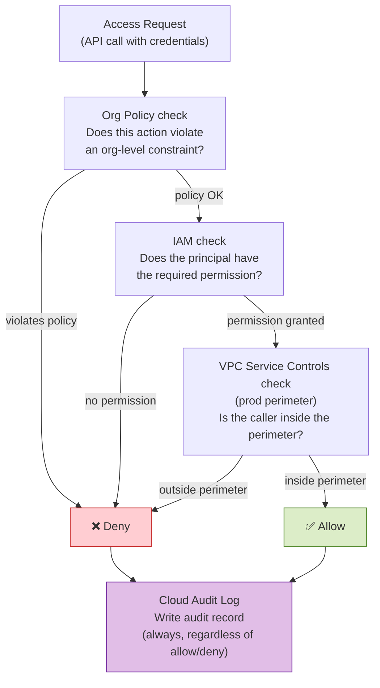
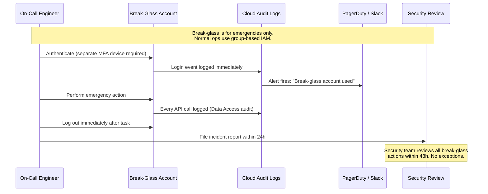

# Diagram: IAM Model

## Identity Hierarchy

```mermaid
graph TD
    subgraph ORG_IAM["Organization-Level IAM"]
        BG1["break-glass-1@domain\nroles/owner\n⚠️ Alert on every use"]
        BG2["break-glass-2@domain\nroles/owner\n⚠️ Alert on every use"]
        TF_SA["terraform-org-admin@admin-project\nroles/resourcemanager.organizationAdmin\n+ 11 specific org-level roles\nImpersonation only — no key export"]
    end

    subgraph FOLDER_IAM["Folder-Level IAM  (via groups)"]
        PLAT_ADMIN["group: platform-admins@\nFolder: all\nroles/resourcemanager.folderAdmin\nroles/iam.securityAdmin"]
        SEC_OPS["group: secops@\nFolder: security/\nroles/securitycenter.admin\nroles/logging.admin"]
        NET_ENG["group: network-engineers@\nFolder: infrastructure/\nroles/compute.networkAdmin"]
        DEV_NONPROD["group: developers@\nFolder: nonprod/ only\nroles/viewer\nroles/logging.viewer"]
    end

    subgraph PROJ_IAM["Project-Level IAM  (workloads)"]
        GKE_SA["gke-workload-{name}@gke-prod\nroles/specific-service-role\nWorkload Identity binding only"]
        APP_SA["app-{name}-sa@app-{name}-prod\nroles/specific-service-role\nno key export"]
        CICD_SA["terraform-apply-nonprod@cicd-platform\nroles/per-layer permissions\nWIF impersonation only"]
    end

    TF_SA -->|"creates + manages"| FOLDER_IAM
    TF_SA -->|"creates + manages"| PROJ_IAM
    PLAT_ADMIN -->|"human access"| FOLDER_IAM

    style ORG_IAM fill:#FFCDD2,stroke:#C62828
    style FOLDER_IAM fill:#FFE0B2,stroke:#E65100
    style PROJ_IAM fill:#DCEDC8,stroke:#558B2F
```

## Service Account Strategy

```mermaid
flowchart LR
    subgraph ANTI["❌ Anti-Patterns"]
        A1["Exported JSON key\nin repo or CI secret"]
        A2["Shared SA across\nmultiple workloads"]
        A3["roles/editor or roles/owner\non any SA"]
        A4["Single SA for\nall Terraform layers"]
    end

    subgraph CORRECT["✅ Correct Patterns"]
        C1["Impersonation only\n(local dev)\nWIF only (CI/CD)"]
        C2["One SA per workload\nleast-privilege roles\nannual review"]
        C3["Specific roles only\nno primitive roles\naudit quarterly"]
        C4["One SA per layer\nscoped to that layer's\nrequired permissions"]
    end

    A1 -.- |"replaced by"| C1
    A2 -.- |"replaced by"| C2
    A3 -.- |"replaced by"| C3
    A4 -.- |"replaced by"| C4

    style ANTI fill:#FFCDD2,stroke:#C62828
    style CORRECT fill:#DCEDC8,stroke:#558B2F
```

## Group-Based IAM — Why Groups, Never Individuals

```mermaid
flowchart TD
    subgraph BAD["❌ Direct user bindings  (never do this)"]
        USER1["alice@company.com → roles/compute.admin"]
        USER2["bob@company.com → roles/storage.admin"]
        NOTE1["Problem: offboarding requires scanning\nevery project's IAM policy.\nEasy to miss. Creates ghost permissions."]
    end

    subgraph GOOD["✅ Group-based bindings  (always do this)"]
        GRP1["group: platform-admins@ → roles/compute.admin"]
        GRP2["group: platform-admins@ → roles/storage.admin"]
        GRP_MGMT["Group membership managed\nin Cloud Identity / Workspace\nOne removal = revoked everywhere\nQuarterly membership review"]

        GRP1 --> GRP_MGMT
        GRP2 --> GRP_MGMT
    end

    style BAD fill:#FFCDD2,stroke:#C62828
    style GOOD fill:#DCEDC8,stroke:#558B2F
```

## Access Decision Flow

```mermaid
flowchart TD
    REQ["Access Request\n(API call with credentials)"]

    ORG_POL["Org Policy check\nDoes this action violate\nan org-level constraint?"]
    IAM_CHK["IAM check\nDoes the principal have\nthe required permission?"]
    VPC_SC["VPC Service Controls check\n(prod perimeter)\nIs the caller inside the perimeter?"]
    AUDIT["Cloud Audit Log\nWrite audit record\n(always, regardless of allow/deny)"]
    ALLOW["✅ Allow"]
    DENY["❌ Deny"]

    REQ --> ORG_POL
    ORG_POL -->|"violates policy"| DENY
    ORG_POL -->|"policy OK"| IAM_CHK
    IAM_CHK -->|"no permission"| DENY
    IAM_CHK -->|"permission granted"| VPC_SC
    VPC_SC -->|"outside perimeter"| DENY
    VPC_SC -->|"inside perimeter"| ALLOW

    ALLOW --> AUDIT
    DENY --> AUDIT

    style DENY fill:#FFCDD2,stroke:#C62828
    style ALLOW fill:#DCEDC8,stroke:#558B2F
    style AUDIT fill:#E1BEE7,stroke:#6A1B9A
```

## Break-Glass Procedure

```mermaid
sequenceDiagram
    participant ENG as On-Call Engineer
    participant BG as Break-Glass Account
    participant SIEM as Cloud Audit Logs
    participant ALERT as PagerDuty / Slack
    participant REVIEW as Security Review

    Note over ENG,REVIEW: Break-glass is for emergencies only.<br/>Normal ops use group-based IAM.

    ENG->>BG: Authenticate (separate MFA device required)
    BG->>SIEM: Login event logged immediately
    SIEM->>ALERT: Alert fires: "Break-glass account used"

    ENG->>BG: Perform emergency action
    BG->>SIEM: Every API call logged (Data Access audit)

    ENG->>BG: Log out immediately after task
    ENG->>REVIEW: File incident report within 24h

    Note over REVIEW: Security team reviews all break-glass<br/>actions within 48h. No exceptions.
```
