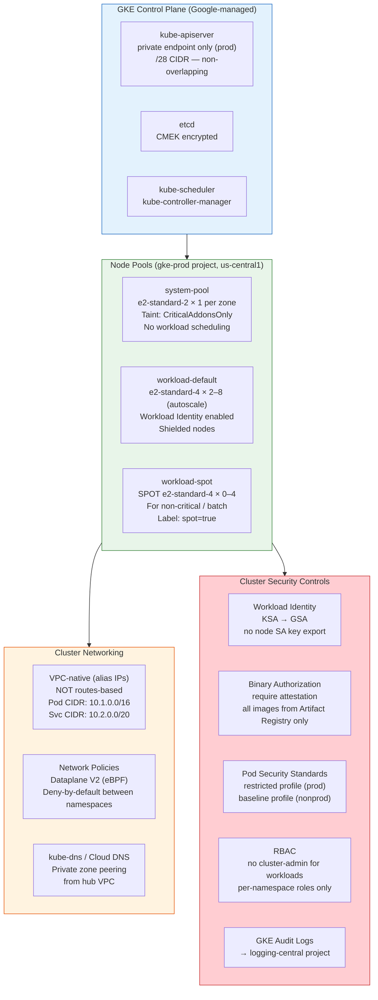
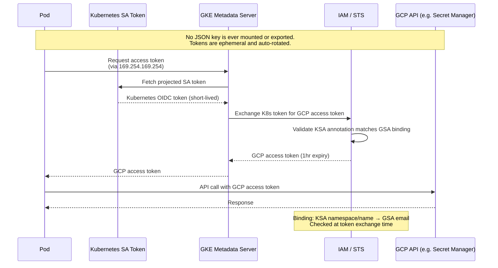
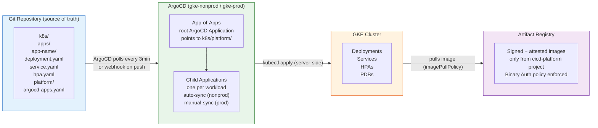
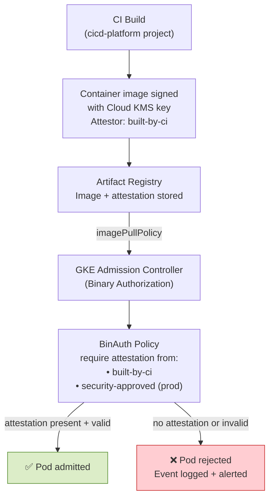

# Diagram: GKE Architecture

## Cluster Topology

## Workload Identity Flow

## GitOps with ArgoCD

## Node Pool Strategy

| Pool | Machine Type | Min/Max | Purpose | Spot | Taint |
|---|---|---|---|---|---|
| `system-pool` | `e2-standard-2` | 1–3 | DaemonSets, ArgoCD, CNI | No | `CriticalAddonsOnly=true:NoSchedule` |
| `workload-default` | `e2-standard-4` | 2–8 | General workloads | No | — |
| `workload-spot` | `e2-standard-4` | 0–4 | Batch, CI jobs, stateless | Yes | `spot=true:NoSchedule` |

**Why separate system pool:** Prevents a misbehaving workload (e.g., resource exhaustion) from evicting critical
cluster components like the CNI, monitoring agents, or ArgoCD itself. System pool is never scaled to zero.

## Binary Authorization Policy Flow

