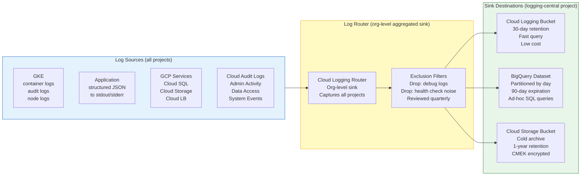
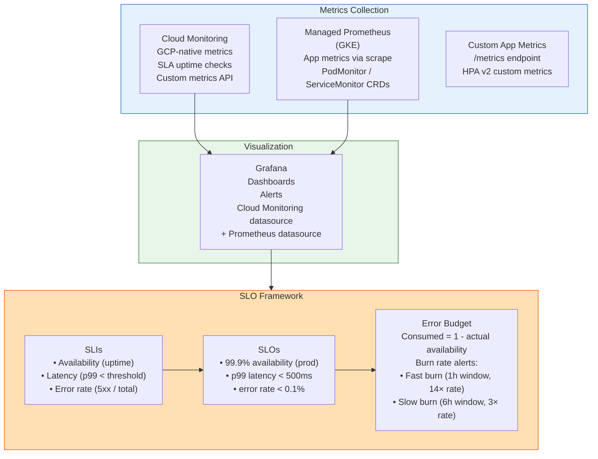
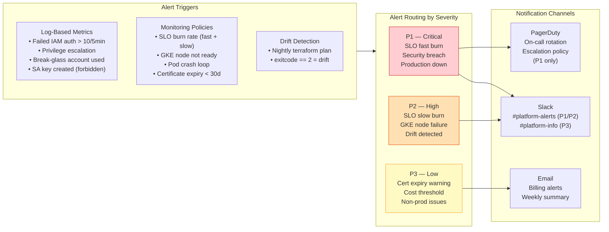
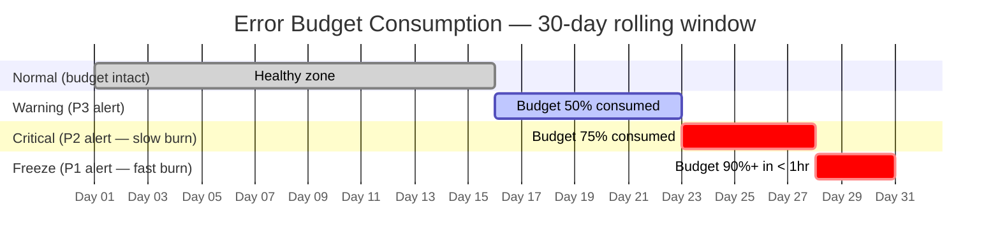
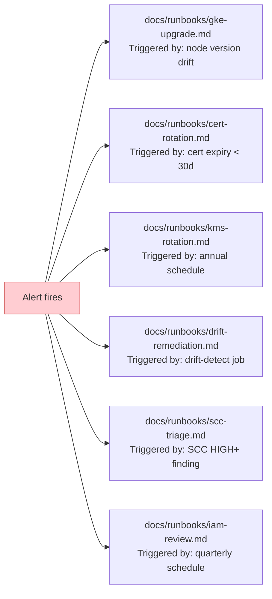

# Diagram: Observability Stack

## Log Flow — Centralized Sink Architecture

## Metrics and Monitoring Stack

## Alerting Pipeline

## SLO Error Budget Burn Rate Alerts

## Log-Based Security Metrics (Phase 4)

| Metric Name | Log Filter | Alert Threshold | Severity |
|---|---|---|---|
| `iam_auth_failures` | `protoPayload.status.code=7` | > 10 in 5min | P2 |
| `privilege_escalation` | `protoPayload.methodName=~"setIamPolicy"` | Any | P1 |
| `break_glass_used` | `protoPayload.authenticationInfo.principalEmail=~"break-glass"` | Any | P1 |
| `sa_key_created` | `protoPayload.methodName="iam.serviceAccounts.keys.create"` | Any | P2 |
| `org_policy_changed` | `protoPayload.methodName=~"orgpolicies"` | Any | P1 |
| `gcs_public_access` | `protoPayload.methodName=~"storage.*" AND protoPayload.resourceName=~"allUsers"` | Any | P1 |

## Runbook Dependency Map

